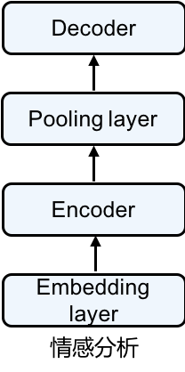

# 情感分析

本节介绍如何使用gluon来创建一个情感分类模型，目标是给定一句话，判断这句话包含的是“正面”还是“负面”的情绪。为此，我们构造了一个简单的神经网络，其中包括embedding层，biLSTM层以及dense层。下面就让我们一起来构造一个情感分析模型吧。


## 准备工作

在开始构造情感分析模型之前，我们需要进行下面的一些准备工作。

### 加载mxnet和gluon

首先，我们当然需要加载mxnet和gluon。

```{.python .input  n=49}
import mxnet as mx
from mxnet import init, gluon, autograd
from collections import Counter
```

### 读取IMDB

接着需要下载情感分析时需要用的数据集。我们使用Stanford's Large Movie Review Dataset作为数据集，下载地址：http://ai.stanford.edu/~amaas/data/sentiment/ 。这个数据集有25,000条从IMDB下载的关于电影的评论，其中12,500条被标注成“正面”的评论，另外12,500条被标注成“负面”的评论。

```{.python .input  n=2}
def readIMDB(dir_url, seg = 'train'):
    import os
    pos_or_neg = ['pos','neg']
    dataset = []
    for lb in pos_or_neg:
        files = os.listdir('../data/'+dir_url+'/'+seg+'/'+lb+'/')
        for file in files:
            with open('../data/'+dir_url+'/'+seg+'/'+lb+'/'+file,'r',encoding='utf8') as rf:
                review = rf.read().replace('\n','')
                if lb == 'pos':
                    dataset.append([review, 1])
                elif lb == 'neg':
                    dataset.append([review, 0])
    return dataset

train_dataset = readIMDB('aclImdb/', 'train')
test_dataset = readIMDB('aclImdb/', 'test')
```

```{.python .input  n=3}
#随机采样1000个样本用于训练

def sample_dataset(dataset, selected_sample_idxs):
    sampled_dataset = []
    for idx in selected_sample_idxs:
        sampled_dataset.append(dataset[idx])
    return sampled_dataset
sampler = gluon.contrib.data.IntervalSampler(len(train_dataset), interval=250, rollover=False)

train_dataset = sample_dataset(train_dataset, list(sampler))
test_dataset = sample_dataset(test_dataset, list(sampler))
```

### 指定分词工具并且分词

```{.python .input  n=4}
import spacy
spacy_en = spacy.load('en')

def tokenizer(text):
    return [tok.text for tok in spacy_en.tokenizer(text)]
```

```{.json .output n=4}
[
 {
  "name": "stderr",
  "output_type": "stream",
  "text": "/Users/chgwang/miniconda3/envs/gluon/lib/python3.6/site-packages/msgpack_numpy.py:84: DeprecationWarning: The binary mode of fromstring is deprecated, as it behaves surprisingly on unicode inputs. Use frombuffer instead\n  dtype=np.dtype(descr)).reshape(obj[b'shape'])\n/Users/chgwang/miniconda3/envs/gluon/lib/python3.6/site-packages/msgpack_numpy.py:88: DeprecationWarning: The binary mode of fromstring is deprecated, as it behaves surprisingly on unicode inputs. Use frombuffer instead\n  dtype=np.dtype(descr))[0]\n"
 }
]
```

```{.python .input  n=5}
train_tokenized = []
train_labels = []
for review, score in train_dataset:
    train_tokenized.append(tokenizer(review))
    train_labels.append(score)
test_tokenized = []
test_labels = []
for review, score in test_dataset:
    test_tokenized.append(tokenizer(review))
    test_labels.append(score)
```

### 创建词典

```{.python .input  n=6}
from mxnet.contrib import text

token_counter = Counter()
def count_token(train_tokenized):
    for sample in train_tokenized:
        for token in sample:
            if token not in token_counter:
                token_counter[token] = 1
            else:
                token_counter[token] += 1

count_token(train_tokenized)
vocab = text.vocab.Vocabulary(token_counter, unknown_token='<unk>', reserved_tokens=None)
```

### 将分好词的数据转化成ndarray

```{.python .input  n=7}
#根据词典，将数据转换成特征向量
def encode_samples(x_raw_samples, vocab):
    x_encoded_samples = []
    for sample in x_raw_samples:
        x_encoded_sample = []
        for token in sample:
            if token in vocab.token_to_idx:
                x_encoded_sample.append(vocab.token_to_idx[token])
            else:
                x_encoded_sample.append(0)
        x_encoded_samples.append(x_encoded_sample)            
    return x_encoded_samples

#将特征向量补成定长
def pad_samples(x_encoded_samples, maxlen = 500, val = 0):
    x_samples = []
    for sample in x_encoded_samples:
        if len(sample) > maxlen:
            new_sample = sample[:maxlen]
        else:
            num_padding = maxlen - len(sample)
            new_sample = sample
            for i in range(num_padding):
                new_sample.append(val)
        x_samples.append(new_sample)
    return x_samples
```

```{.python .input  n=8}
x_encoded_train = encode_samples(train_tokenized, vocab)
x_encoded_test = encode_samples(test_tokenized, vocab)
```

```{.python .input  n=9}
#指定context
context = mx.cpu()
x_train = mx.nd.array(pad_samples(x_encoded_train, 500, 0), ctx=context)
x_test = mx.nd.array(pad_samples(x_encoded_test, 500, 0), ctx=context)
```

```{.python .input  n=10}
y_train = mx.nd.array([score for text, score in train_dataset], ctx=context)
y_test = mx.nd.array([score for text, score in test_dataset], ctx=context)
```

### 加载预训练的词向量

```{.python .input  n=11}
glove_embedding = text.embedding.create('glove', pretrained_file_name='glove.6B.100d.txt', vocabulary=vocab)
```

```{.python .input  n=64}
data = x_train[0:10]
```

```{.python .input  n=82}
y_train
```

```{.json .output n=82}
[
 {
  "data": {
   "text/plain": "\n[1. 1. 1. 1. 1. 1. 1. 1. 1. 1. 1. 1. 1. 1. 1. 1. 1. 1. 1. 1. 1. 1. 1. 1.\n 1. 1. 1. 1. 1. 1. 1. 1. 1. 1. 1. 1. 1. 1. 1. 1. 1. 1. 1. 1. 1. 1. 1. 1.\n 1. 1. 0. 0. 0. 0. 0. 0. 0. 0. 0. 0. 0. 0. 0. 0. 0. 0. 0. 0. 0. 0. 0. 0.\n 0. 0. 0. 0. 0. 0. 0. 0. 0. 0. 0. 0. 0. 0. 0. 0. 0. 0. 0. 0. 0. 0. 0. 0.\n 0. 0. 0. 0.]\n<NDArray 100 @cpu(0)>"
  },
  "execution_count": 82,
  "metadata": {},
  "output_type": "execute_result"
 }
]
```

```{.python .input  n=66}
data = data.T
```

```{.python .input  n=74}
data = mx.nd.concat(data[0], data[data.shape[0]-1])
```

```{.python .input  n=76}
data = net.decoder(data)
```

```{.python .input  n=33}
data = mx.nd.reshape(x_train[0:10,], (-2, batch_size)).as_in_context(context)
```

```{.json .output n=33}
[
 {
  "ename": "MXNetError",
  "evalue": "[15:16:06] src/operator/tensor/./matrix_op-inl.h:157: Check failed: oshape.Size() == dshape.Size() (50000 vs. 5000) Target shape size is different to source. Target: [10,500,10]\nSource: [10,500]\n\nStack trace returned 8 entries:\n[bt] (0) 0   libmxnet.so                         0x0000000111d24ccf libmxnet.so + 56527\n[bt] (1) 1   libmxnet.so                         0x0000000111d24a6f libmxnet.so + 55919\n[bt] (2) 2   libmxnet.so                         0x0000000112d19088 libmxnet.so + 16785544\n[bt] (3) 3   libmxnet.so                         0x0000000112e88c9a MXNDListFree + 433578\n[bt] (4) 4   libmxnet.so                         0x0000000112e878a9 MXNDListFree + 428473\n[bt] (5) 5   libmxnet.so                         0x0000000112df7627 MXCustomFunctionRecord + 17559\n[bt] (6) 6   libmxnet.so                         0x0000000112df8850 MXImperativeInvokeEx + 176\n[bt] (7) 7   libffi.6.dylib                      0x00000001100e0884 ffi_call_unix64 + 76\n\n",
  "output_type": "error",
  "traceback": [
   "\u001b[0;31m---------------------------------------------------------------------------\u001b[0m",
   "\u001b[0;31mMXNetError\u001b[0m                                Traceback (most recent call last)",
   "\u001b[0;32m<ipython-input-33-0386da22c5dd>\u001b[0m in \u001b[0;36m<module>\u001b[0;34m()\u001b[0m\n\u001b[0;32m----> 1\u001b[0;31m \u001b[0mdata\u001b[0m \u001b[0;34m=\u001b[0m \u001b[0mmx\u001b[0m\u001b[0;34m.\u001b[0m\u001b[0mnd\u001b[0m\u001b[0;34m.\u001b[0m\u001b[0mreshape\u001b[0m\u001b[0;34m(\u001b[0m\u001b[0mx_train\u001b[0m\u001b[0;34m[\u001b[0m\u001b[0;36m0\u001b[0m\u001b[0;34m:\u001b[0m\u001b[0;36m10\u001b[0m\u001b[0;34m,\u001b[0m\u001b[0;34m]\u001b[0m\u001b[0;34m,\u001b[0m \u001b[0;34m(\u001b[0m\u001b[0;34m-\u001b[0m\u001b[0;36m2\u001b[0m\u001b[0;34m,\u001b[0m \u001b[0mbatch_size\u001b[0m\u001b[0;34m)\u001b[0m\u001b[0;34m)\u001b[0m\u001b[0;34m.\u001b[0m\u001b[0mas_in_context\u001b[0m\u001b[0;34m(\u001b[0m\u001b[0mcontext\u001b[0m\u001b[0;34m)\u001b[0m\u001b[0;34m\u001b[0m\u001b[0m\n\u001b[0m",
   "\u001b[0;32m/Users/chgwang/miniconda3/envs/gluon/lib/python3.6/site-packages/mxnet/ndarray/register.py\u001b[0m in \u001b[0;36mreshape\u001b[0;34m(data, shape, reverse, target_shape, keep_highest, out, name, **kwargs)\u001b[0m\n",
   "\u001b[0;32m/Users/chgwang/miniconda3/envs/gluon/lib/python3.6/site-packages/mxnet/_ctypes/ndarray.py\u001b[0m in \u001b[0;36m_imperative_invoke\u001b[0;34m(handle, ndargs, keys, vals, out)\u001b[0m\n\u001b[1;32m     90\u001b[0m         \u001b[0mc_str_array\u001b[0m\u001b[0;34m(\u001b[0m\u001b[0mkeys\u001b[0m\u001b[0;34m)\u001b[0m\u001b[0;34m,\u001b[0m\u001b[0;34m\u001b[0m\u001b[0m\n\u001b[1;32m     91\u001b[0m         \u001b[0mc_str_array\u001b[0m\u001b[0;34m(\u001b[0m\u001b[0;34m[\u001b[0m\u001b[0mstr\u001b[0m\u001b[0;34m(\u001b[0m\u001b[0ms\u001b[0m\u001b[0;34m)\u001b[0m \u001b[0;32mfor\u001b[0m \u001b[0ms\u001b[0m \u001b[0;32min\u001b[0m \u001b[0mvals\u001b[0m\u001b[0;34m]\u001b[0m\u001b[0;34m)\u001b[0m\u001b[0;34m,\u001b[0m\u001b[0;34m\u001b[0m\u001b[0m\n\u001b[0;32m---> 92\u001b[0;31m         ctypes.byref(out_stypes)))\n\u001b[0m\u001b[1;32m     93\u001b[0m \u001b[0;34m\u001b[0m\u001b[0m\n\u001b[1;32m     94\u001b[0m     \u001b[0;32mif\u001b[0m \u001b[0moriginal_output\u001b[0m \u001b[0;32mis\u001b[0m \u001b[0;32mnot\u001b[0m \u001b[0;32mNone\u001b[0m\u001b[0;34m:\u001b[0m\u001b[0;34m\u001b[0m\u001b[0m\n",
   "\u001b[0;32m/Users/chgwang/miniconda3/envs/gluon/lib/python3.6/site-packages/mxnet/base.py\u001b[0m in \u001b[0;36mcheck_call\u001b[0;34m(ret)\u001b[0m\n\u001b[1;32m    147\u001b[0m     \"\"\"\n\u001b[1;32m    148\u001b[0m     \u001b[0;32mif\u001b[0m \u001b[0mret\u001b[0m \u001b[0;34m!=\u001b[0m \u001b[0;36m0\u001b[0m\u001b[0;34m:\u001b[0m\u001b[0;34m\u001b[0m\u001b[0m\n\u001b[0;32m--> 149\u001b[0;31m         \u001b[0;32mraise\u001b[0m \u001b[0mMXNetError\u001b[0m\u001b[0;34m(\u001b[0m\u001b[0mpy_str\u001b[0m\u001b[0;34m(\u001b[0m\u001b[0m_LIB\u001b[0m\u001b[0;34m.\u001b[0m\u001b[0mMXGetLastError\u001b[0m\u001b[0;34m(\u001b[0m\u001b[0;34m)\u001b[0m\u001b[0;34m)\u001b[0m\u001b[0;34m)\u001b[0m\u001b[0;34m\u001b[0m\u001b[0m\n\u001b[0m\u001b[1;32m    150\u001b[0m \u001b[0;34m\u001b[0m\u001b[0m\n\u001b[1;32m    151\u001b[0m \u001b[0;34m\u001b[0m\u001b[0m\n",
   "\u001b[0;31mMXNetError\u001b[0m: [15:16:06] src/operator/tensor/./matrix_op-inl.h:157: Check failed: oshape.Size() == dshape.Size() (50000 vs. 5000) Target shape size is different to source. Target: [10,500,10]\nSource: [10,500]\n\nStack trace returned 8 entries:\n[bt] (0) 0   libmxnet.so                         0x0000000111d24ccf libmxnet.so + 56527\n[bt] (1) 1   libmxnet.so                         0x0000000111d24a6f libmxnet.so + 55919\n[bt] (2) 2   libmxnet.so                         0x0000000112d19088 libmxnet.so + 16785544\n[bt] (3) 3   libmxnet.so                         0x0000000112e88c9a MXNDListFree + 433578\n[bt] (4) 4   libmxnet.so                         0x0000000112e878a9 MXNDListFree + 428473\n[bt] (5) 5   libmxnet.so                         0x0000000112df7627 MXCustomFunctionRecord + 17559\n[bt] (6) 6   libmxnet.so                         0x0000000112df8850 MXImperativeInvokeEx + 176\n[bt] (7) 7   libffi.6.dylib                      0x00000001100e0884 ffi_call_unix64 + 76\n\n"
  ]
 }
]
```

## 创建情感分析模型

神经网络结构比较简单，如下图所示。



```{.python .input  n=83}
nclass = 2
lr = 0.1
epochs = 1
batch_size = 10
emsize = 100
nhid = 100
nlayers = 2
bidirectional = True

class SentimentNet(gluon.Block):
    def __init__(self, vocab, emsize, nhid, nlayers, bidirectional, **kwargs):
        super(SentimentNet, self).__init__(**kwargs)
        with self.name_scope():
            self.embedding = gluon.nn.Embedding(len(vocab), emsize, weight_initializer=init.Uniform(0.1))
            self.encoder = gluon.rnn.LSTM(nhid, num_layers=nlayers, bidirectional=bidirectional, input_size=emsize)
            self.decoder = gluon.nn.Dense(nclass)
    def forward(self, inputs, begin_state=None):
        outputs = self.embedding(inputs)
        outputs = self.encoder(outputs)
        outputs = mx.nd.concat(outputs[0], outputs[outputs.shape[0]-1])
        outputs = self.decoder(outputs)
        return outputs
    
net = SentimentNet(vocab, emsize, nhid, nlayers, bidirectional)
net.initialize(mx.init.Xavier(), ctx=context)
net.embedding.weight.set_data(glove_embedding.idx_to_vec.as_in_context(context))
net.embedding.collect_params().setattr('grad_req', 'null')
trainer = gluon.Trainer(net.collect_params(), 'sgd',
                       {'learning_rate': lr})
loss = gluon.loss.SoftmaxCrossEntropyLoss()
```

## 训练模型

```{.python .input  n=86}
#使用accuracy作为评价指标
def eval(x_samples, y_samples):
    accuracy = mx.metric.Accuracy()
    for i in range(x_samples.shape[0]//batch_size):
        data = x_train[i*batch_size:(i+1)*batch_size]
        target = y_train[i*batch_size:(i+1)*batch_size]
        data = data.as_in_context(context).T
        target = target.as_in_context(context).T
        output = net(data)
        predicts = mx.nd.argmax(output, axis=1)
        accuracy.update(preds=predicts, labels=target)
    return accuracy.get()[1]
```

```{.python .input  n=87}
for epoch in range(epochs):
    for i in range(x_train.shape[0]//batch_size):
        data = x_train[i*batch_size:(i+1)*batch_size]
        target = y_train[i*batch_size:(i+1)*batch_size]
        data = data.as_in_context(context).T
        target = target.as_in_context(context).T
        with autograd.record():
            output = net(data)
            L = loss(output, target)
        L.backward()
        trainer.step(batch_size)
        if i % 10 == 0:
            print("Batch %s. loss %s"%(i, L.asnumpy()))
    train_accuracy = eval(x_train, y_train)
    test_accuracy = eval(x_test, y_test)
    print("Epoch %s. Train_acc %s, Test_acc %s"%(epoch, train_accuracy, test_accuracy))
```

```{.json .output n=87}
[
 {
  "name": "stdout",
  "output_type": "stream",
  "text": "Batch 0. loss [0.8850705  0.89992434 0.8947954  0.8833381  0.9013978  0.90739346\n 0.8713056  0.88355994 0.87615055 0.9600185 ]\nEpoch 0. Train_acc 0.5, Test_acc 0.5\n"
 }
]
```

```{.python .input  n=89}
#例子
net(mx.nd.reshape(mx.nd.array([vocab.token_to_idx['This'], vocab.token_to_idx['movie'], 
                                 vocab.token_to_idx['is'], vocab.token_to_idx['great']], 
                                ctx=context), shape=(-1, 1))).sigmoid()
```

```{.json .output n=89}
[
 {
  "data": {
   "text/plain": "\n[[0.56882524 0.42506438]]\n<NDArray 1x2 @cpu(0)>"
  },
  "execution_count": 89,
  "metadata": {},
  "output_type": "execute_result"
 }
]
```
